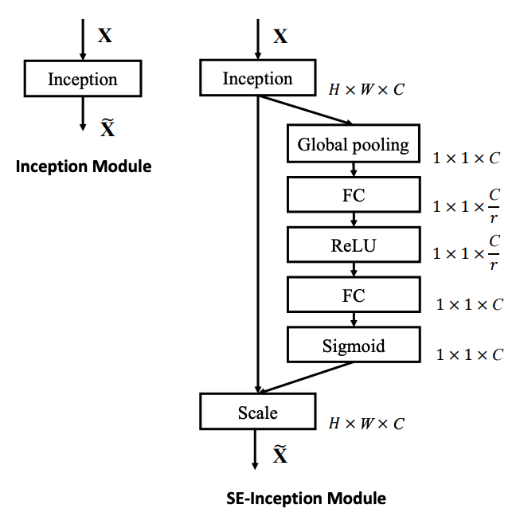
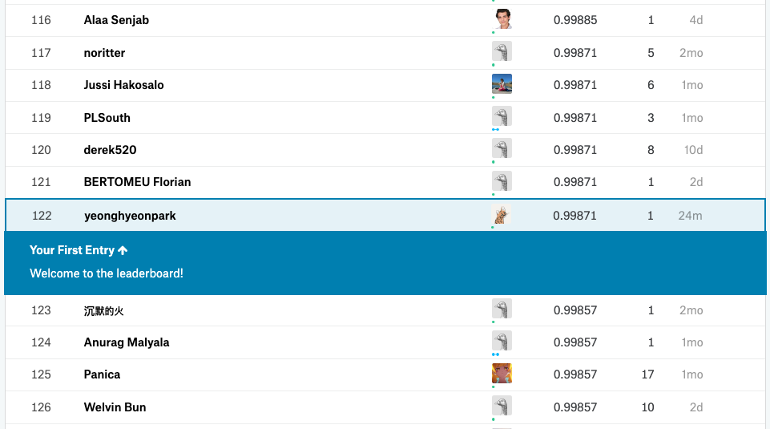

[Kaggle] Squeeze and Excitation Networks
=====

## Squeeze and Excitation (SE) Module

    
  
The Squeeze and Excitation (SE) Module [1].

## Performance

    
  
The performance measured by<a href="https://www.kaggle.com/c/digit-recognizer/leaderboard">Kaggle</a>.

## Reference
[1] Hu, Jie, et al. (2018). <a href="https://arxiv.org/abs/1709.01507">Squeeze-and-excitation networks.</a> Proceedings of the IEEE conference on computer vision and pattern recognition. 2018.
